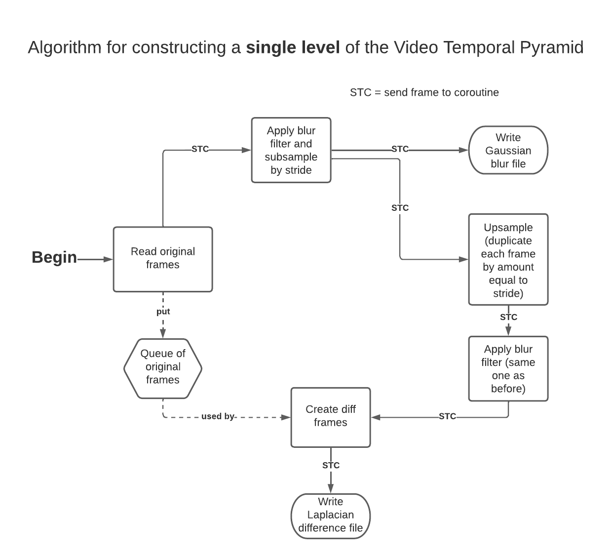

# Video Temporal Pyramids and Video Spectrogram
Code for the paper "Visualizing the Passage of Time with Video Temporal Pyramids" (https://arxiv.org/abs/2208.11885).

The peer-reviewed Suppplementary Material for the paper can be found at https://drive.google.com/drive/folders/1YhUgYItT8MmhX2Sg4vu1XqmxlP84FtKy.

## Data Preprocessing
The datasets which were used in the paper can be downloaded from https://drive.google.com/drive/folders/178cKRUI5HBM_afJmBB9OBlzxZx9zJ4Pg (see datasets.json file for the metadata for these datasets, which is in the necessary format for the pyramid building code). If you want to use one of our provided datasets, you will need to update datasets.json with the appropriate filepaths after you download the data. Specifically, update the values for 'dirpath' (i.e., where the original data is being stored) and 'pyr\_result\_path' (i.e., where the processed pyramids will be stored).

If you wish to build a pyramid from your own dataset, here are some important dataset preprocessing tips:
* Videos need to be in .mp4 format. Images can be in any standard image format which can be read by imageio, such as .jpg or .png.
* Insert an empty text file with a filename that ends in 'MISSING.txt' for each missing image or video. Use a consistent naming convention so that those placeholder files for missing data sort into the right order alongside the real data files.
* The code has been optimized for 24-hours-per-day or 16-hours-per-day of data coverage. It should be able to handle 8-hours-per-day and 12-hours-per-day as well, but those options have not been tested.

## Set up environment
* For Video Temporal Pyramid code only: 
	- Use Python >= 3.7 
	- Dependencies listed in `requirements_pyramid_only.txt` 
	- For pip, do `pip install -r requirements_pyramid_only.txt`
* For Video Temporal Pyramid as well as Video Spectrogram code:
	- ...coming soon!

## Build a temporal pyramid
* Create the pyramid up through level 15 (1 frame per 24 hours) for each day in your dataset. This command will process one individual day (in this example, specifically for Jan 6, 2019 of the Buxton dataset). 
```
python pyramid_main.py Buxton pyr-1-day -date 190106
```
* In order to parallelize the building of all daily pyramids, run a batch of jobs for all dates if you have a cluster of compute resources available (e.g., HTCondor or Slurm). In this case, it may be helpful to create a text file listing all of the desired dates in yymmdd format. A script for this can be found in the utils folder (`make_date_list_txt.py`).
* Once all daily pyramids have been built (up through level 15), then build the higher levels (up through level 21, the one-year timescale) by running the following command for each year (again, this can be batched if there are many years):
```
python pyramid_main.py Buxton pyr-multi-day -yr 2019
```
* However, if your dataset's timespan is one year or less, omit the -yr parameter altogether.

* If your dataset's timespan covers multiple years, then you will need to finish building the higher pyramid levels above level 21 (the one-year level), using the following command:
```
python pyramid_main.py Buxton pyr-multi-year
```
* Here is a high-level conceptual illustration of how the video frames are processed during the creation of one level of the pyramid:


<br>

## Reconstruct and upsample pyramid videos
* Using already-built pyramid levels, reconstruct a copy of one level's Gaussian blur video using the following command:
```
python pyramid_main.py Buxton reconstruct -top 22 -bot 10
``` 
* Replace 'Buxton' with the name of your dataset. The -top parameter indicates the top level at which to start reconstruction (the Gaussian blur video at this level will be used). The -bot parameter indicates the bottom-most level, which is the one that will end up being reconstructed. The example command above will recreate the Gaussian blur video from Buxton level 10 (30-minute timescale). 
* In order to upsample a Gaussian blur video so that its duration is extended without changing the timescale shown, you can include the -sub parameter during reconstruction to indicate which level(s) to skip. Any skipped levels will have the upsampling step performed but will not add in the Laplacian difference video. Multiple level numbers should be listed separated with spaces and single-digit numbers can be listed with single digits (meaning, 8 is fine, 08 is not fine). Usage is like this:
```
python pyramid_main.py Buxton reconstruct -top 22 -bot 10 -sub 11 12 13 14 15 16 17 18 19 20 21 22
```  
* For standard upsampling, subtract all levels above (but not including) the bottom level, including the top level. This format is flexible and allows for choosing some (but not all) levels to subtract, which can create non-standard effects that may also be of interest.
* NOTE: Currently, the reconstruction code stitches together all individual daily videos, which means it is generally not practical or desired to reconstruct lower than about level 8 (5-minute timescale) as the videos would be very large.

## Build a video spectrogram
...coming soon!

